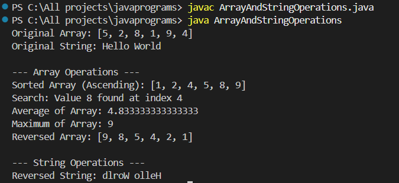
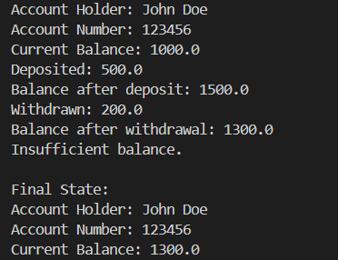
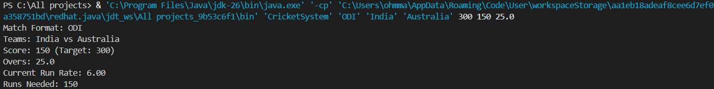
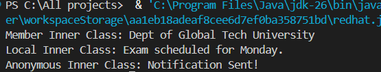

# 💻 Java Programming Assignment

📘 **Course:** Programming with Java  
📂 **Repository:** Java-Programming-Assignment  

---

## 👨‍🎓 Student Details
- **Name:** Om h machhi
- **Enrollment No:** 12502080603013
- **Semester:** 4th  
- **Academic Year:** 2025-26  

---

## 📑 Assignment Overview
This repository contains all Java programs developed as part of the assignment.  
Each program demonstrates core Java concepts including:
- Arrays & Strings
- Object-Oriented Programming (OOP)
- Constructors
- Inheritance
- Abstract Classes
- Exception Handling
- Inner Classes

---

# 📘 Programs List

---

## 🔹 Program 1: Array and String Operations
✔ Reverse  
✔ Sort  
✔ Search  
✔ Average  
✔ Maximum  

📸 **Output:**  

---

## 🔹 Program 2: Matrix Operations
✔ Constructors  
✔ Transpose  
✔ Multiplication  

📸 **Output:**  

---

## 🔹 Program 3: Wrapper Classes & String vs StringBuffer
✔ Wrapper Classes Demonstration  
✔ String vs StringBuffer Comparison  

📸 **Output:**  

---

## 🔹 Program 4: Bank Account System
✔ Deposit  
✔ Withdraw  
✔ Balance Inquiry  

📸 **Output:**  

---

## 🔹 Program 5: Cricket Match System (Inheritance + CLI)
✔ Inheritance  
✔ Command Line Arguments  

📸 **Output:**  

---

## 🔹 Program 6: Cipher System (Abstract Class)
✔ Abstract Class  
✔ Method Overriding  

📸 **Output:**  

---

## 🔹 Program 7: Inner Classes Demonstration
✔ Member Inner Class  
✔ Local Inner Class  
✔ Anonymous Inner Class  

📸 **Output:**  

---

## 🔹 Program 8: Custom Exception Handling
✔ User-defined Exception  
✔ Bank Withdrawal Scenario  

📸 **Output:**  

---

# 📁 Folder Structure
