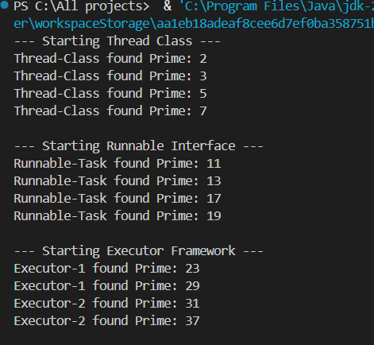
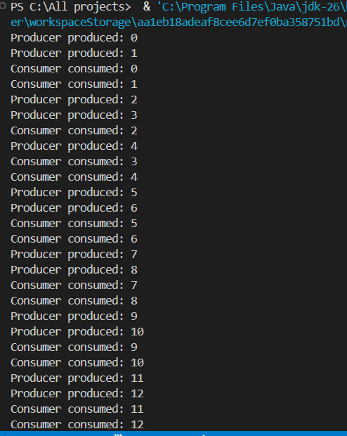
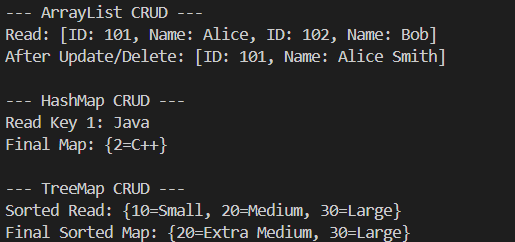
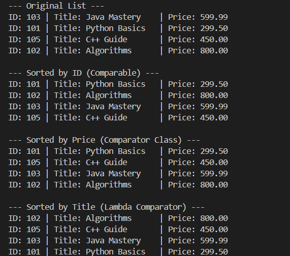
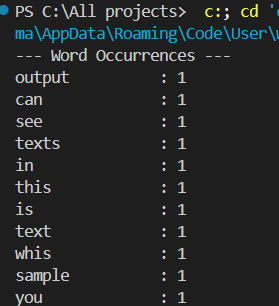
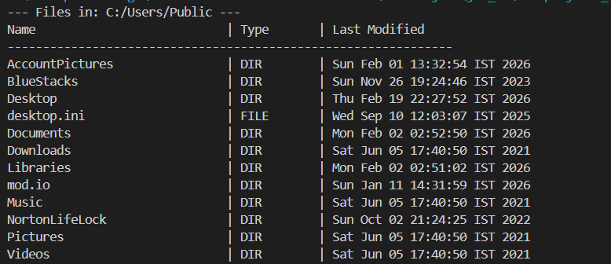
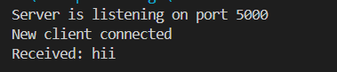
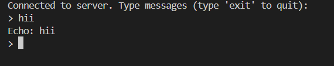
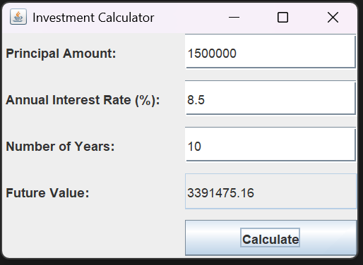

# 💻 Java Programming Assignment

  

  <b>📘 Programming with Java</b> 
  <i>Complete Practical Implementation Repository</i>

  
  
  

---

## 👨‍🎓 Student Details
| Field | Details |
|------|--------|
| 👤 Name | Om H Machhi |
| 🆔 Enrollment No | 12502080603013 |
| 🎓 Semester | 4th |
| 📅 Academic Year | 2025-26 |

---

## 📑 Assignment Overview
This repository contains **two complete Java assignments** demonstrating:

✨ Object-Oriented Programming (OOP)  
✨ Arrays & Strings  
✨ Inheritance & Polymorphism  
✨ Abstract Classes  
✨ Exception Handling  
✨ Multithreading & Synchronization  
✨ Collection Framework  
✨ File Handling & Networking  
✨ GUI Development (Swing)  

---

# 📘 Assignment – 1 (Core Java Concepts)

---

## 🔹 Program 1: Array and String Operations
📌 Reverse • Sort • Search • Average • Maximum  

  

---

## 🔹 Program 2: Matrix Operations
📌 Constructors • Transpose • Multiplication  

  

---

## 🔹 Program 3: Wrapper Classes & StringBuffer
📌 Wrapper Classes • String vs StringBuffer  

  

---

## 🔹 Program 4: Bank Account System
📌 Deposit • Withdraw • Balance Inquiry  

  

---

## 🔹 Program 5: Cricket Match System
📌 Inheritance • Command Line Arguments  

  

---

## 🔹 Program 6: Cipher System
📌 Abstract Class • Method Overriding  

  

---

## 🔹 Program 7: Inner Classes
📌 Member • Local • Anonymous  

  

---

## 🔹 Program 8: Custom Exception Handling
📌 User-defined Exception • Banking Scenario  

  

---

# 📘 Assignment – 2 (Advanced Java Concepts)

---

## 🔹 Program 1: Multithreaded Prime Checker
📌 Thread creation • Prime logic  

  

---

## 🔹 Program 2: Producer-Consumer Problem
📌 Multithreading • Synchronization • Shared Buffer  

  

---

## 🔹 Program 3: CRUD using Collection API
📌 ArrayList • HashMap • Data Handling  

  

---

## 🔹 Program 4: Book Sorting
📌 Comparable • Comparator  

  

---

## 🔹 Program 5: Word Count from File
📌 File Handling • Text Processing  

  

---

## 🔹 Program 6: Directory Lister
📌 File & Directory Operations  

  

---

## 🔹 Program 7: Socket Programming (Client-Server)
📌 Echo Server • Echo Client  

  

  

---

## 🔹 Program 8: Investment Calculator (GUI)
📌 Java Swing • Event Handling  

  

---

# 📁 Repository Structure
Java-Programming-Assignment/
│
├── Assignment-1/
├── Assignment-2/
└── README.md
